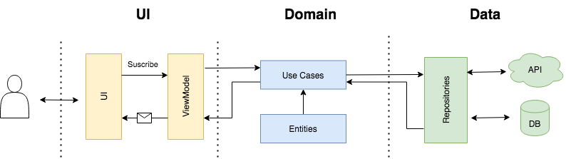

# Android Marvel App

This application has been developed and designed as a sample app based on [Marvel Api](https://developer.marvel.com/). It includes a complete architectural approach as well as a simple navigation between screens.

## Architecture stack

Within each feature module (at the present time only `app`), I've followed a clean architecture approach with a 3 layer division: **ui**, **domain** and **data**:

- **ui:** includes the view and its controller logic with a [MVVM](https://developer.android.com/jetpack/guide?hl=es-419) approach, so it contains *Fragments*, *ViewModels* and its state realted object. Besides, it contains any other view related objects as _adapters_, _customViews_, etc.
- **domain:** business logic which is represented by _Use cases_. The _Use case_ will be in charge of changing the thread. For this purpose I have used [Kotlin Coroutines](https://kotlinlang.org/docs/reference/coroutines-overview.html). The _Use case_ will always return the _Result_ in the _UIThread_.
- **data**: it is the app repository. All the data managed by the application is retrieved from this layer. Based on the _Repository pattern_ I got a couple of data sources, one for the network and other for local storage (database).

## Assumptions

In the behalf of readability and simplification, some assumptions have been made.

- **model classes**: whilst with an strict architectural approach each of the layers exposed above must have their own model classes (data model, domain model and ui model), in this project I have only used one model, the one that comes from the API.
- **modularization**: in spite of the intention of having multiple modules splited up by feature, this project only have (for the time being) one single module with multiple packages.

## Pending

Despite the app is able to run as it is provided, there are some pending improvements I would like to keep working on in the future:

#### Local cache

At the present time there are two empty local data sources. These data sources are pretended to store the data retrieved from the network in order to serve these data in the future even before calling to the network datasource as well as in case of network error. This way the user is able to interact with the application even though there is no internet connection. Technology: Room data base.

#### Infinite scrolling

At the present time there is no implementation for infinite scrolling. It is pending to be done with [Jetpack's paging library](https://developer.android.com/topic/libraries/architecture/paging)

## License

    Copyright 2020 Javier Martínez

    Licensed under the Apache License, Version 2.0 (the "License");
    you may not use this file except in compliance with the License.
    You may obtain a copy of the License at

       http://www.apache.org/licenses/LICENSE-2.0

    Unless required by applicable law or agreed to in writing, software
    distributed under the License is distributed on an "AS IS" BASIS,
    WITHOUT WARRANTIES OR CONDITIONS OF ANY KIND, either express or implied.
    See the License for the specific language governing permissions and
    limitations under the License.

